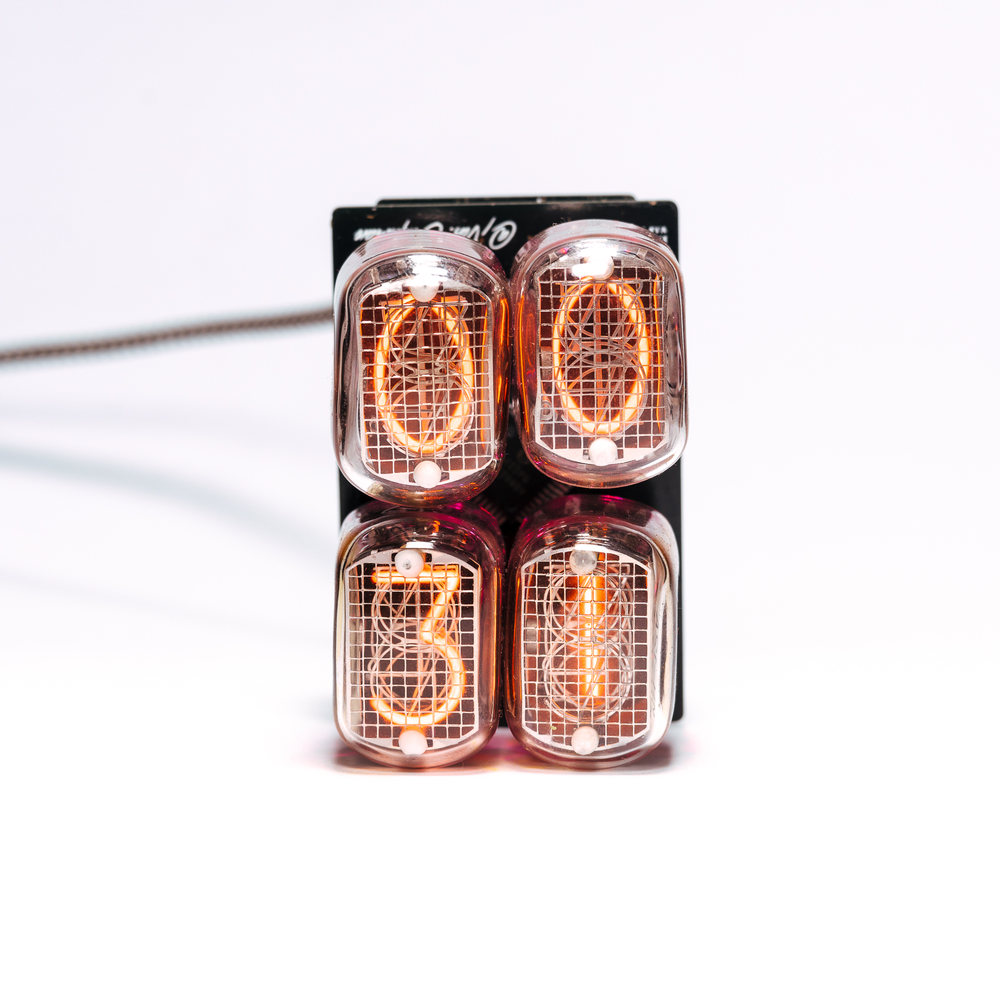
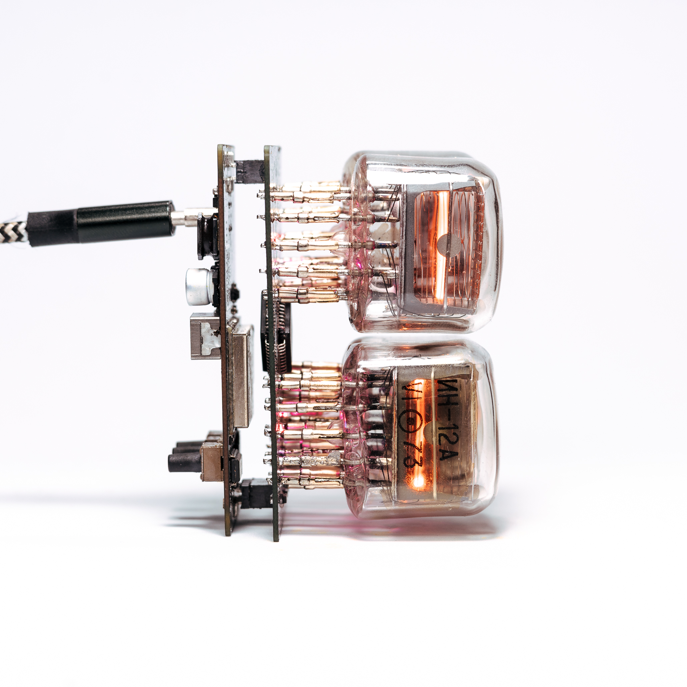
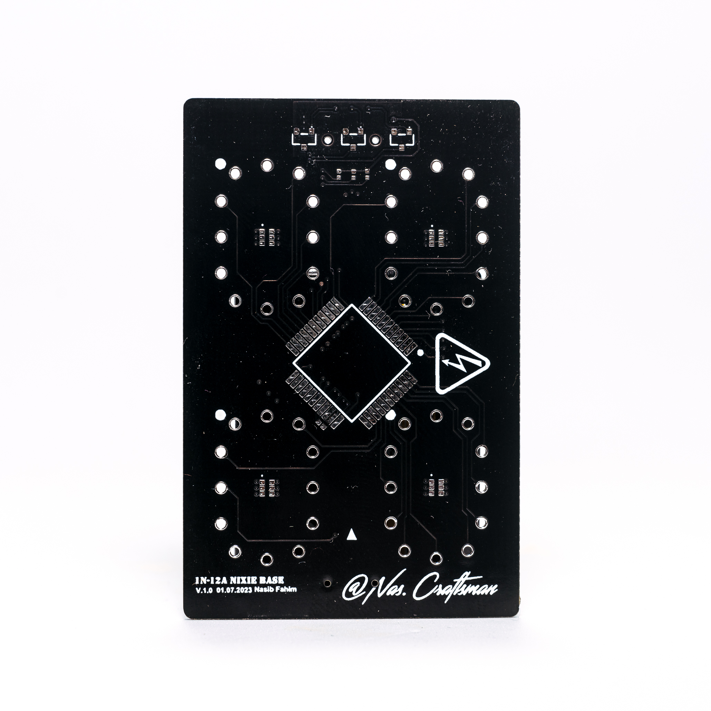
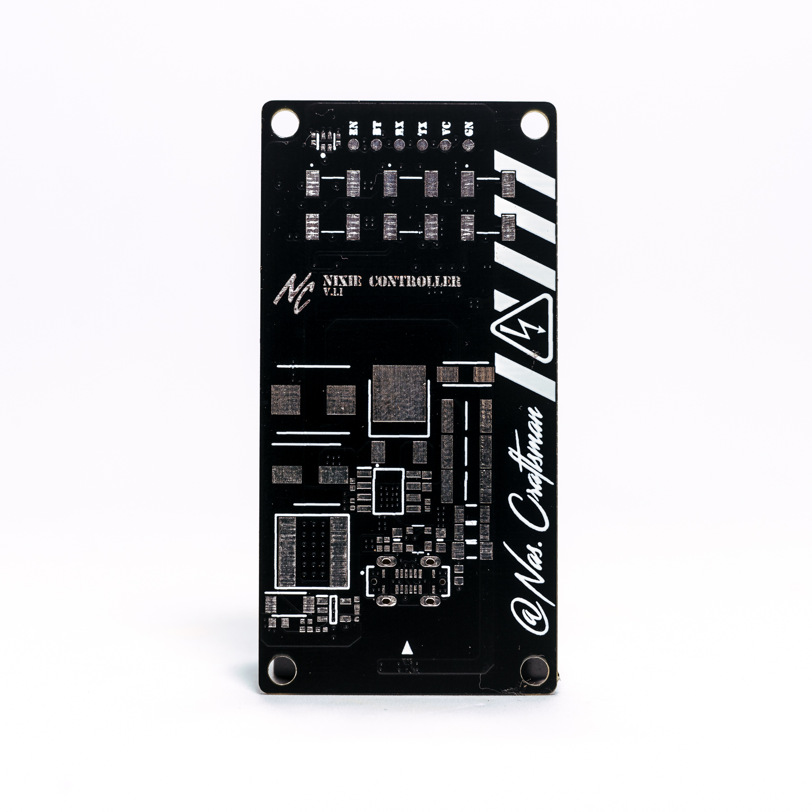
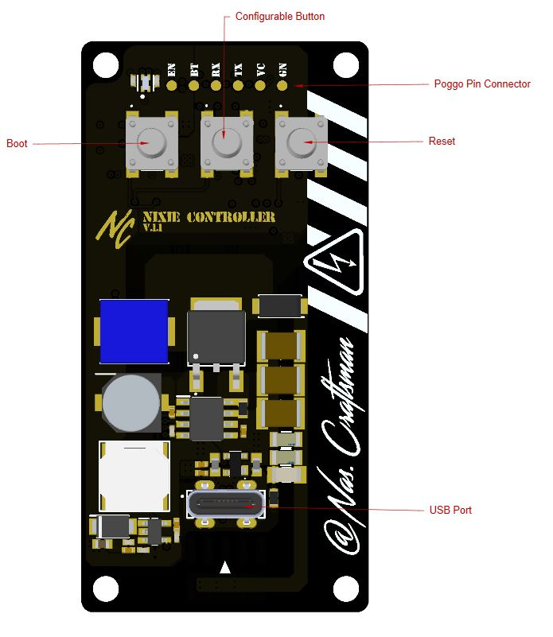
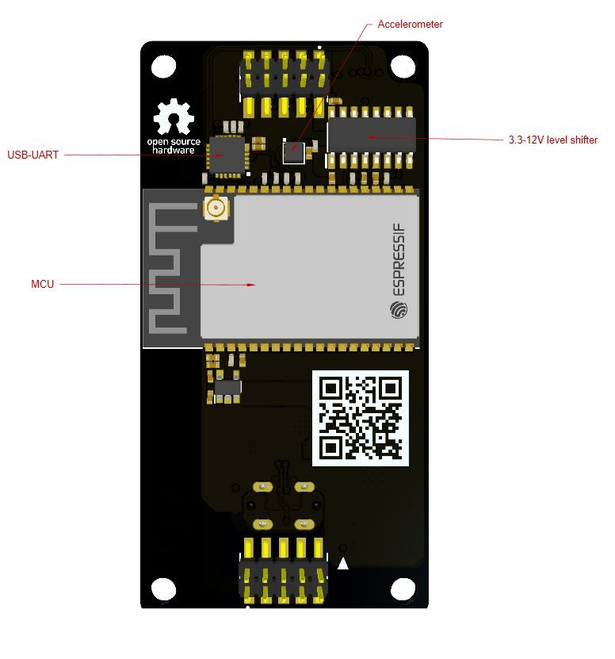

# OpenNixie 

</a>
</a>
</a>

OpenNixie was born with the aim of creating an open project development platform around all types of Nixie Tubes. A platform that condenses the future with the past. The IoT technology with the famous plasma tubes in a miniature and modular design.

OpenNixie is a BLE and Wifi platform for different applications. It was originally designed as a RTC with an Internet connection, but later became a universal platform with many applications. This system is based on the ESP32-WROVER-IE Module, includes a 170V power stage and can be powered and programmed directly through the USB-C connector.

Some of the features that the OpenNixie platform includes are:

- Dimensions are only 30x60mm
- Wifi and BLE connected
- Modular design: it can be used for different Nixie tubes shapes and applications
- USB Type-C for power and programming
- 4 1N-12A + RGB lights as a default Nixie extension board 
- 1 general pourpose button for control the platform
  

## Multi Board Architecture
 
OpenNixie has been designed as a modular platform. This means that the control PCB can be connected to any PCB with Nixie tubes, so the applications are unlimited. At the moment the V2 version has been tested with a base for 4 1N-12A Nixies with RGB LEDs and SPI expansion.

</a>
</a>

## Warning

OpenNixie uses the USB-C port to power the plasma tubes. For this, two power stages are created, one 12V LV and another 170V HV. The HV stage is limited to 1A, so it could be dangerous depending on the power supply used.

## GPIOs

Function | GPIO V2 | Mode
-------- | -------- | --------
SCK | GPIO2 | Output
MOSI | GPIO4 | Output
Button | GPIO15 | Input
I2C_SDA | GPI18 | Output/Input
I2C_SCL | GPI19 | Output
LED G | GPIO21 | Output
LED R | GPIO22 | Output
LED B | GPIO23 | Output
Logic EN | GPIO25 | Output
ACC INT | GPIO26 | Input
EN 170V | GPIO32 | Output
EN 12V | GPIO33 | Output

* The RGB signals control the background color of the ambient LEDs under the Nixie tubes
* The ACC INT signal is triggered by an event in the accelerometer
* The I2C bus controls the accelerometer
* To activate the Nixie tubes, the ignition sequence should be: EN12-ON EN170-OFF LE-ON
* To deactivate Nixie tubes, the shutdown sequence should be: LE-OFF EN170-ON EN12-OFF

## Board overview C3T (Battery connections)

</a>
</a>

## Flashing firmware to the ESP32 

- Press and hold BOOT button while press and release EN button, then release BOOT button to enter in BOOT mode
- You can use the USB-C directly to programm the device

## Media

